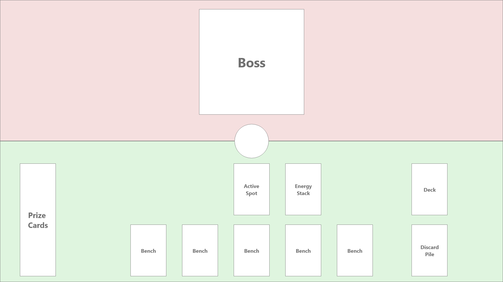
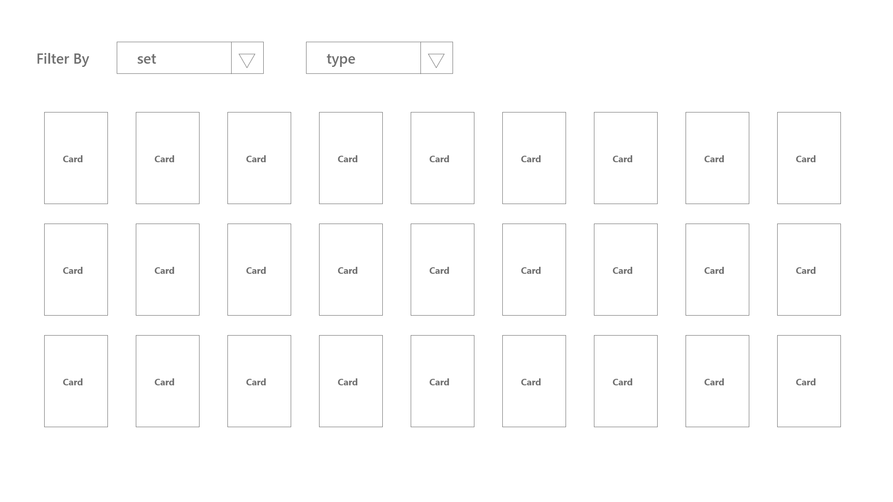

# About the Game

This is a customized version of **Pokemon Trading Card Game**. Instead of a regular 2 player mode, we are going to create a single player version with a goal of defeating a randomly generated boss.

## 1. Board

- Board is where you place the boss and the players card
- The players' side of the board should be categorized into multiple sections as shown in the layout image
  

## 2. Boss

- A boss is randomly generated with high HP and low ATK value
- The player has first turn. After every players' turn, the boss counter attacks dealing some damage to the player.
- The logic for players play is similar to Pokemon TCG game

## 3. Player

- A player is the person who will be playing the game with a goal to defeat the boss.
- Player has the flexibility of creating a deck or choose a randomly generated deck
- First turn of the game is always the player.
- In the first turn the player should place a basic pokemon card in the "Active Spot" section. Whatever the attack value is in the card, the boss will be dealt with equal damage in the first round

## 4. Deck

- A Deck is a collection of exactly 60 cards.
- There are 3 categries of cards in the deck - Pokemon Cards, Trainer Cards and Energy Cards
- Each category has 20 cards
- Out of 20 **Trainer Cards**, there will be **7 Item Cards**, **7 Stadium Cards** and **6 Supporter Cards**
- Deck can either be randomly generated or the player can create by selecting **20 Pokemon** cards. The **Trainer Cards** and **Energy Cards** are generated randomly irrespecitive of game type.

### 4.1. Creating a Deck by the Player

- The player will have a list of **Basic Pokemon Cards** to choose from.
- Player must choose exactly 20 **Basic Pokemon Cards**
- The upper limit of any card with the same Pokemon name is 4.
  

### 4.2. Creating a Deck Programmatically

- Choose 5 characters with basic type randomly
- Select 4 cards of each characters
- Add 20 of trainer cards and energy cards

## 5. Gameplay

- The game heavily relies on the Pokemon TCG game, thus all the rules of that game applies here.
- The difference is this game is not a two player, rather a single player game to fight a ranndomly generated boss.
- This is a turn based game in which the player always attacks first.
- A random boss is summoned and placed in the **Boss Card** slot.
- A deck is created either manually or automatically
- An automatic deck creation involves randomly selecting 20 of each (Trainer, Pokemon and Energy Cards). The deck is then shuffled.
- Manual Deck creation involves allowing the player to select 20 Pokemon cards. Trainer and Energy cards are randomly assigned. The deck is then shuffled.
- After a deck is created, the player is assigned 7 cards from the top of the deck and assigned to **Players Hand Cards** spot
- 6 prize cards are picked from the top of the deck and placed in the **Prize Cards** spot
- Once the cards are distributed, the player will choose a **Basic Pokemon Card** and place it in **Active Spot** section of the board.
- If the player does not posses a basic pokemon card, a random basic card is withdrawn from the deck and placed in the **Active Spot** section
- The game starts with a players turn. Each turn for the player involves following set of activities

  1. Draw a card.
  2. Do any of the following actions in any order:
     1. Put Basic Pokémon cards from your hand onto your Bench (as many as you want).
     2. Evolve your Pokémon (as many as you want).
     3. Attach an Energy card from your hand to one of your Pokémon (once per turn).
     4. Play Trainer cards (as many as you want, but only one Supporter card and one Stadium card per turn).
     5. Retreat your Active Pokémon (only once per turn).
     6. Use Abilities (as many as you want).
  3. Attack. Then, end your turn.

- After every attack (by the player or the boss), the HP of the enemy will reduce by attack attribute on the card.
- The game continues until one of the party is defeated.
- **_Player Win Conditions:_**
  1. Lower Boss HP to 0
- **_Player Lose Conditions:_**
  1. The HP of the **Pokemon Card** in the **Active Spot** is reduced to 0.
  2. Run out of all the cards in **Prize Card Spot** and **Player's Hand** before reducing boss HP to 0.
  3. No remaining cards in the **Deck** and all the cards in h**Prize Card Spot** and **Player's Hand** are used before reducing boss HP to 0.
- Visit the link for detailed rules [Pokemon Card Game Rule Book](https://www.pokemon.com/static-assets/content-assets/cms2/pdf/trading-card-game/rulebook/par_rulebook_en.pdf)

# References

- [Pokemon TCG API documentation](https://docs.pokemontcg.io/)
- [Pokemon TCG Rule Book](https://www.pokemon.com/static-assets/content-assets/cms2/pdf/trading-card-game/rulebook/par_rulebook_en.pdf)
